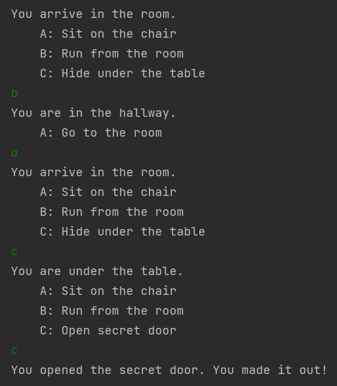

# Text Adventure Game Player
An engine to create a simple text-based adventure game, modeling the traversal of events in the game with a graph.

An example playing a room escape game:

# Configuration
Configure your game in the Event Definitions file, `src/main/resources/event_definitions.csv`.

The entry point to your game, the first event that the Event Player plays, is the first (0th) record of the Event Definitions file.

Your game will exit successfully if the player reaches a terminal event, i.e. the event has no children defined in the "children" field.

# Running
Run your adventure game by running the `src/main/java/Main.java` file using Gradle.

# Development
Developed in Java using IntelliJ IDEA and built using Gradle.

The CSV file is read using [tablesaw](https://github.com/jtablesaw/tablesaw).

All events defined in the CSV file are constructed as an Event object within the directed graph EventGraph.

